## Distribución de red
| **Equipo**                   | **Dirección IP** |
| ---------------------------- | ---------------- |
| `LinuxBackup`                | 192.168.57.10    |
| `WindowsServer`              | 192.168.57.11    |
| `LinuxServer`                | 192.168.56.10    |
| `LinuxClient`                | 192.168.56.101   |
| `WindowsClient`              | 192.168.56.102   |
| `LinuxRouter2 (Host-Only 0)` | 192.168.56.253   |
| `LinuxRouter2 (Host-Only 1)` | 192.168.57.254   |
| `LinuxRouter1 (Host-Only 1)` | 192.168.56.254   |

De esta forma nos queda una red de esta forma:

```mermaid
flowchart LR

    %% =========================
    %% INTERNET / NAT
    %% =========================
    subgraph NAT["Internet / NAT"]
        INTERNET["Internet"]
    end

    %% =========================
    %% ROUTER 1
    %% =========================
    R1["LinuxRouter1"]

    %% =========================
    %% HOST-ONLY 0
    %% =========================
    subgraph RED56["Host-Only 0<br/>192.168.56.0/24"]
        direction TB

        LS["LinuxServer<br/>192.168.56.10"]
        LC["LinuxClient<br/>192.168.56.101"]
        WC["WindowsClient<br/>192.168.56.102"]
    end

    %% =========================
    %% ROUTER 2
    %% =========================
    R2["LinuxRouter2<br/>192.168.56.253<br/>192.168.57.254"]

    %% =========================
    %% HOST-ONLY 1
    %% =========================
    subgraph RED57["Host-Only 1<br/>192.168.57.0/24"]
        direction TB

        LB["LinuxBackup<br/>192.168.57.10"]
        WS["WindowsServer<br/>192.168.57.11"]
    end

    %% =========================
    %% CONNECTIONS
    %% =========================
    INTERNET --- R1
    R1 --- RED56
    RED56 --- R2
    R2 --- RED57

    %% =========================
    %% STYLES
    %% =========================
    classDef device fill:#003b6f,stroke:#8fc7ff,color:#9fd0ff,stroke-width:1px;
    classDef router fill:#003b6f,stroke:#ffffff,color:#9fd0ff,stroke-width:1px;
    classDef network fill:#222222,stroke:#aaaaaa,color:#ffffff,stroke-width:1px;

    class INTERNET,LS,LC,WC,LB,WS device;
    class R1,R2 router;
```


Vamos a explicar la configuración de las máquinas `LinuxRouter` exhaustivamente y de las demás de forma genérica.
#### `LinuxRouter1`
Configurar la tarjeta de red
`/etc/network/interfaces`:
```
auto enp0s8
iface enp0s8 inet static 
	address 192.168.56.254
	netmask 255.255.255.0
```
Habilitar `port-forwarding` para el reenvio de paquetes
```
sudo sysctl -w net.ipv4.ip_forward=1
```

para que se mantenga:
```
echo "net.ipv4.ip_forward=1" | sudo tee /etc/sysctl.d/99-ip-forward.conf
sudo /sbin/sysctl -p /etc/sysctl.d/99-ip-forward.conf
sudo sysctl net.ipv4.ip_forward # para comprobar que nos sale a 1
```

Aplicar las iptables que dice la practica:

Primero hay que instalar iptables porque no la tenemos  
```
sudo apt update && sudo apt install iptables iptables-persistent -y
```

```
iptables -t nat -A <POSTROUTING> -o enp0s3 -j <MASQUERADE>
```

Por ultimo tenemos que guardar la regla para que quede persistente si rebooteamos
```
sudo netfilter-persistent save
sudo cat /etc/iptables/rules.v4
```

#### `LinuxRouter2`
Configurar la tarjeta de red
`/etc/network/interfaces`:
```
auto enp0s3
iface enp0s3 inet static
        address 192.168.56.253
        netmask 255.255.255.0
        gateway 192.168.56.254
auto enp0s8
iface enp0s8 inet static
        address 192.168.57.254
        netmask 255.255.255.0
```

Activamos `port-forwarding`:
```
echo "net.ipv4.ip_forward=1" | sudo tee /etc/sysctl.d/99-ip-forward.conf
sudo /sbin/sysctl -p /etc/sysctl.d/99-ip-forward.conf
```
Hacemos la comprobación:
```
sudo sysctl net.ipv4.ip_forward # para comprobar que nos sale a 1
```

#### `Linux`:
En las máquinas `linux` para cambiar la `ip` y mantenerla de forma estática haremos:
`/etc/network/interfaces`
```
auto enp0s3
iface enp0s3 inet static
    address 192.168.56.10
    netmask 255.255.255.0
    gateway 192.168.56.254
    dns-nameservers 8.8.8.8 1.1.1.1
```

#### `Windows`:
