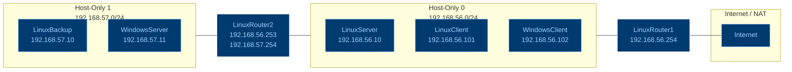

## Distribución de red
| **Equipo**                   | **Dirección IP** |
| ---------------------------- | ---------------- |
| `LinuxBackup`                | 192.168.57.10    |
| `WindowsServer`              | 192.168.57.11    |
| `LinuxServer`                | 192.168.56.10    |
| `LinuxClient`                | 192.168.56.101   |
| `WindowsClient`              | 192.168.56.102   |
| `LinuxRouter2 (Host-Only 0)` | 192.168.56.253   |
| `LinuxRouter2 (Host-Only 1)` | 192.168.57.254   |
| `LinuxRouter1 (Host-Only 0)` | 192.168.56.254   |

De esta forma nos queda una red de esta forma:

```mermaid
flowchart RL

    %% =========================
    %% INTERNET / NAT
    %% =========================
    subgraph NAT["Internet / NAT"]
        INTERNET["Internet"]
    end

    %% =========================
    %% ROUTER 1
    %% =========================
    R1["LinuxRouter1"<br/>192.168.56.254]
	
    %% =========================
    %% HOST-ONLY 0
    %% =========================
    subgraph RED56["Host-Only 0<br/>192.168.56.0/24"]
        direction TB

        LS["LinuxServer<br/>192.168.56.10"]
        LC["LinuxClient<br/>192.168.56.101"]
        WC["WindowsClient<br/>192.168.56.102"]
    end

    %% =========================
    %% ROUTER 2
    %% =========================
    R2["LinuxRouter2<br/>192.168.56.253<br/>192.168.57.254"]

    %% =========================
    %% HOST-ONLY 1
    %% =========================
    subgraph RED57["Host-Only 1<br/>192.168.57.0/24"]
        direction TB

        LB["LinuxBackup<br/>192.168.57.10"]
        WS["WindowsServer<br/>192.168.57.11"]
    end

    %% =========================
    %% CONNECTIONS
    %% =========================
    INTERNET --- R1
    R1 --- RED56
    RED56 --- R2
    R2 --- RED57

    %% =========================
    %% STYLES
    %% =========================
    classDef device fill:#003b6f,stroke:#8fc7ff,color:#9fd0ff,stroke-width:1px;
    classDef router fill:#003b6f,stroke:#ffffff,color:#9fd0ff,stroke-width:1px;
    classDef network fill:#222222,stroke:#aaaaaa,color:#ffffff,stroke-width:1px;

    class INTERNET,LS,LC,WC,LB,WS device;
    class R1,R2 router;
```

Vamos a explicar la configuración de las máquinas `LinuxRouter` exhaustivamente y de las demás de forma genérica.
#### `LinuxRouter1`
Configurar la tarjeta de red
`/etc/network/interfaces`:
```
auto enp0s8
iface enp0s8 inet static 
	address 192.168.56.254
	netmask 255.255.255.0
```
Habilitar `port-forwarding` para el reenvio de paquetes
```
sudo sysctl -w net.ipv4.ip_forward=1
```

para que se mantenga:
```
echo "net.ipv4.ip_forward=1" | sudo tee /etc/sysctl.d/99-ip-forward.conf
sudo /sbin/sysctl -p /etc/sysctl.d/99-ip-forward.conf
sudo sysctl net.ipv4.ip_forward # para comprobar que nos sale a 1
```

Aplicar las iptables que dice la practica:

Primero hay que instalar iptables porque no la tenemos  
```
sudo apt update && sudo apt install iptables iptables-persistent -y
```

```
iptables -t nat -A <POSTROUTING> -o enp0s3 -j <MASQUERADE>
```

Por ultimo tenemos que guardar la regla para que quede persistente si rebooteamos
```
sudo netfilter-persistent save
sudo cat /etc/iptables/rules.v4
```

#### `LinuxRouter2`
Configurar la tarjeta de red
`/etc/network/interfaces`:
```
auto enp0s3
iface enp0s3 inet static
        address 192.168.56.253
        netmask 255.255.255.0
        gateway 192.168.56.254
auto enp0s8
iface enp0s8 inet static
        address 192.168.57.254
        netmask 255.255.255.0
```

Activamos `port-forwarding`:
```
echo "net.ipv4.ip_forward=1" | sudo tee /etc/sysctl.d/99-ip-forward.conf
sudo /sbin/sysctl -p /etc/sysctl.d/99-ip-forward.conf
```
Hacemos la comprobación:
```
sudo sysctl net.ipv4.ip_forward # para comprobar que nos sale a 1
```

#### `Linux`:
En las máquinas `linux` para cambiar la `ip` y mantenerla de forma estática haremos:
`/etc/network/interfaces`
```
auto enp0s3
iface enp0s3 inet static
    address 192.168.56.10
    netmask 255.255.255.0
    gateway 192.168.56.254
    dns-nameservers 8.8.8.8 1.1.1.1
```

#### `Windows`:
```
New-NetIPAddress -InterfaceAlias "Ethernet" -IPAddress "192.168.57.11" -PrefixLength 24 -DefaultGateway "192.168.56.254"
Set-DnsClientServerAddress -InterfaceAlias "Ethernet" -ServerAddresses 8.8.8.8,1.1.1.1
```

Para poner la red en privado:
```
Get-NetConnectionProfile
Set-NetConnectionProfile -InterfaceAlias "Ethernet" -NetworkCategory Private
```

## Configuración SSH para todas las VMs
Tenemos que hacer la instalacion de `Openssh` para las maquinas `windows`. Es lo que explicaremos ahora y después ya nos centraremos en los siguientes aspectos de la práctica.
#### Windows ssh config
Para instalar `OpenSSH`:
```
add-windowscapability -online -name OpenSSH.server
``` 

Después iniciamos el servicio y comprobamos que funciona:
```
Start-Service sshd
Get-Service sshd
Set-Service -Name sshd -StartupType Automatic
Get-NetTCPConnection -LocalPort 22
```
Hacemos las comprobaciones y aseguramos que lo hemos hecho bien.
#### Configuración de SSH
[[Configuración SI SSH]]
En este archivo explicamos que hacer desde la maquina SI

## Reconfiguraciones de practicas anteriores
Como en practicas anteriores hemos hecho unas configuraciones ahora solo tenemos que cambiar ligeramente algunas cosas que ya hemos hecho anteriormente.
#### `RSYSLOG`
En todos los `linux` menos en `LinuxServer` tenemos que modificar este fichero y cambiar la `ip`: `/etc/rsyslog.d/01-remoto.conf` añadimos la `ip` de `LinuxBackup` nueva

Para que funcione el servicio y coja la configuración que queremos:
```
sudo systemctl restart rsyslog
```

Para comprobar que funciona otra vez:
```
logger "Prueba rsyslog hacia LinuxBackup tras resegmentacion"
```

#### ACTIVAR ADMINISTRADOR
```
Enable-LocalUser -Name "Administrador"  
```

```
Set-LocalUser -Name "palangana2026.ABC" -Password $Password
```
#### QUITAR ICMP DEL FIREWALL WINDOWS
```
Meter eso en los dos Windows para que nos permite los pings
```

```
Enable-NetFirewallRule -Name "FPS-ICMP4-ERQ-In"
```
Hacemos esto para poder hacer ping a la maquina. Y saber que ya está running

#### NFS
Modificar en `LinuxServer`:
`/etc/exports`:
```
/srv/nfs/share 192.168.56.0/24(rw,sync,no_subtree_check) 192.168.57.0/24(rw,sync,no_subtree_check)
```

Hacemos la prueba desde `LinuxClient` por ejemplo 
```
sudo mkdir -p /mnt/nfs_share
sudo mount -t nfs 192.168.56.10:/srv/nfs/share /mnt/nfs_share
df -h /mnt/nfs_share
```
hacemos una prueba de escritura:
```
touch /mnt/nfs_share/prueba_escritura.txt
```
y comprobar que se crea en `LinuxBackup`

## `NXLog`
El equipo `windowsserver` deberá configurarse para enviar los registros de eventos del sistema al servidor centralizado de logs. Para ello deberemos instalar el programa libre `NXLog Community Edition`.
Creamos un directorio para almacenar temporalmente el instalador:

```
$New-Item -ItemType Directory -Path C:\Temp\NXLog -Force
```
Posteriormente comprobamos que existía:
```
$Test-Path "C:\Temp\NXLog"
```
Resultado: `True`

Descargamos el instalador de `NXLog Community Edition` dentro de `C:\Temp\NXLog`
La instalación se realizó mediante `msiexec` en modo silencioso:
```
$msiexec /i "C:\Temp\NXLog\nxlog-ce-3.2.2329.msi" /qn /norestart
```

Después comprobamos que el archivo de configuración había sido instalado:
```
$Test-Path "C:\Program Files\nxlog\conf\nxlog.conf"
```
Resultado: `True`

También comprobamos el servicio:
```
Get-Service nxlog
```
Resultado:
```
Status   Name    DisplayName

------   ----    -----------

Running  nxlog   nxlog
```

Modificamos el fichero `C:\Program Files\nxlog\conf\nxlog.conf`  
Lo que tenemos que modificar es el final del archivo
```
<Extension _syslog>

    Module      xm_syslog

</Extension>  
<Input in>

    Module  im_msvistalog

</Input>

<Output out>

    Module      om_tcp

    Host        192.168.57.10

    Port        513

    Exec        to_syslog_ietf();

</Output>  
<Route windows_to_linux>

    Path    in => out

</Route>
```
Reiniciamos el servicio:  
```
$Restart-Service nxlog
```
Comprobamos nuevamente la conectividad:
```
$Test-NetConnection 192.168.57.10 -Port 513
```
Resultado: `TcpTestSucceeded : True`

Finalmente realizamos una prueba generando un evento desde `windowsserver`. Se utilizó:
```
eventcreate /T INFORMATION /ID 1000 /L APPLICATION /SO NXLogTest /D "Prueba de envio de logs desde WindowsServer mediante NXLog"
```
Después comprobamos en `linuxbackup` los archivos modificados recientemente y se generan.

## Servicio de actualizaciones mediante línea de comandos
#### `windowsserver`
Configurar el sistema `WindowsServer` para poder gestionar las actualizaciones de Windows desde una terminal, incluyendo la posibilidad de ejecutar el proceso mediante una conexión `ssh`.
Además, en los equipos destinados a funcionar como servidores, el enunciado establece que las actualizaciones **no deben ejecutarse periódicamente**, sino que deben realizarse únicamente de forma manual.

Para ello se utilizará:
- `PowerShell`
- Módulo `PSWindowsUpdate`
- `schtasks.exe`
- Una tarea programada ejecutada con la cuenta SYSTEM.

###### **Instalación de `PSWindowsUpdate`**
El módulo utilizado para gestionar Windows Update desde PowerShell es `PSWindowsUpdate`.
La instalación se realizó mediante:
```
$Install-Module PSWindowsUpdate -Force
```
Posteriormente se importó el módulo:
```
$Import-Module PSWindowsUpdate
```
Para comprobar que el módulo está instalado:
```
$Get-Module -ListAvailable PSWindowsUpdate
```
Resultado obtenido:
```
ModuleType Version    Name

Binary     2.2.1.5    PSWindowsUpdate
```
Por tanto, el módulo `PSWindowsUpdate` está correctamente instalado en `windowsserver`.
###### **Comprobación de `Windows Update` desde `PowerShell`**
Una vez instalado el módulo, se puede consultar `Windows Update` desde `PowerShell` mediante:
```
$Get-WindowsUpdate
```
Este comando permite **consultar las actualizaciones** disponibles en el sistema.
Para instalar las actualizaciones se utiliza:
```
$Install-WindowsUpdate -AcceptAll
```
Durante las pruebas se utilizó también:
```
$Install-WindowsUpdate -AcceptAll -IgnoreReboot
```
El parámetro `-AcceptAll` permite aceptar todas las actualizaciones encontradas sin solicitar confirmación individual.
El parámetro `-IgnoreReboot` evita que el proceso reinicie automáticamente el equipo durante las pruebas.

###### **Creación del script de actualización**
Para evitar problemas de comillas y comandos complejos al ejecutar `PowerShell` desde `schtasks.exe`, se creó un script independiente.
Se creó el directorio:
```
$mkdir C:\Scripts
```
Y el archivo:
```
C:\Scripts\updatewindows.ps1
```
Contenido del script:
```
$Import-Module PSWindowsUpdate
$Install-WindowsUpdate -AcceptAll -IgnoreReboot
```
Se comprobó posteriormente su contenido mediante:
```
$Get-Content C:\Scripts\updatewindows.ps1
```
El resultado confirmó que el script contiene los comandos necesarios para importar `PSWindowsUpdate` y ejecutar las actualizaciones.

###### **Creación de la tarea programada**
El objetivo de la tarea es permitir que el proceso de actualización pueda ejecutarse bajo una cuenta con los permisos necesarios, independientemente de la sesión SSH del usuario.
La tarea se creó mediante:
```
$schtasks.exe /create /tn "updatewindows" /sc once /st 23:59 /ru SYSTEM /tr "powershell.exe -NoProfile -ExecutionPolicy Bypass -File C:\Scripts\updatewindows.ps1"
```
**Parámetros utilizados**:

| **Parámetro**       | **Función**                                      |
| ------------------- | ------------------------------------------------ |
| /créate             | Crea una nueva tarea programada                  |
| /tn "updatewindows" | Nombre de la tarea                               |
| /sc once            | Configura una programación de una sola ejecución |
| /st 23:59           | Establece una hora válida para la programación   |
| /ru SYSTEM          | Ejecuta la tarea como SYSTEM                     |
| /tr                 | Define el programa que debe ejecutarse           |

La tarea **no se configura de forma periódica** porque el servidor debe actualizarse únicamente bajo demanda.

###### **Comprobación de la tarea**
La configuración se comprobó mediante:
```
$schtasks.exe /query /tn "updatewindows" /fo LIST /v
```
Entre los valores obtenidos destacan:
```
Estado de tarea programada: Habilitado
Ejecutar como usuario:      SYSTEM
Tipo de programación:       Solo una vez
Repetir: cada:              Deshabilitado
```
Esto demuestra que:
1. La tarea está habilitada.
2. Se ejecuta con la cuenta SYSTEM.
3. No existe una programación periódica.
4. Cumple el requisito establecido para los servidores.

###### **Ejecución manual mediante /run**
El enunciado establece que en los servidores las actualizaciones deben realizarse **manualmente**.
Para ello se utilizó:
```
$schtasks.exe /run /tn "updatewindows"
```
Este comando permite iniciar inmediatamente la tarea programada sin esperar a la hora establecida en su programación. De esta forma, la actualización puede iniciarse desde una conexión SSH utilizando únicamente la línea de comandos.

###### **Comprobación de la ejecución**
Después de ejecutar:
```
$schtasks.exe /run /tn "updatewindows"
```
se comprobó que la tarea había comenzado a ejecutarse mediante:
```
$schtasks.exe /query /tn "updatewindows" /fo LIST /v
```
Durante la ejecución se observó:
```
Estado: En ejecución
Ejecutar como usuario: SYSTEM
```
También se comprobó que los procesos necesarios de `Windows Update` estaban activos:
```
$Get-Service wuauserv,bits
```
Resultado:
```
Status   Name
Running  bits
Running  wuauserv
```
Esto confirma que tanto `BITS` como `Windows Update` estaban funcionando durante el proceso.

###### **Verificación de las actualizaciones instaladas**
Finalmente, se comprobó el historial de `Windows Update`:
```
$Get-WUHistory | Select-Object -First 5
```
Se obtuvieron varias operaciones con resultado: `Succeeded`
Entre ellas aparecieron instalaciones realizadas a las `10:08`, `10:11` y `10:12` del `01/10/2026`.
Por tanto, se pudo comprobar que la ejecución de la tarea no se limitó a iniciar PowerShell, sino que el proceso de `PSWindowsUpdate` realizó correctamente instalaciones de actualizaciones.

#### `windowsclient1`


## Instalación y configuración de IIS
Para ello deberemos instalar esto:
```
Install-WindowsFeature Web-Server,Web-CGI
```
Comprobamos que hemos instalado bien:
```
PS C:\Users\administrador> Get-WindowsFeature Web-Server, Web-CGI   

Display Name                                            Name                       Install State
------------                                            ----                       -------------
[X] Servidor web (IIS)                                  Web-Server                     Installed
            [X] CGI                                     Web-CGI                        Installed

```

#### `php`
Descargamos `php`:
```
Invoke-WebRequest `
-Uri "https://downloads.php.net/~windows/releases/archives/php-8.5.10-nts-Win32-vs17-x64.zip" `
-OutFile "$env:TEMP\php.zip"
```

Creamos el directorio `C:\PHP`:
```
New-Item -ItemType Directory -Path C:\PHP -Force
```
Y descomprimimos:
```
Expand-Archive `
  -Path "$env:TEMP\php.zip" `
  -DestinationPath C:\PHP `
  -Force
```
Comprobamos que tenemos el ejecutable:
```
Test-Path C:\PHP\php-cgi.exe
```
Nos devuelve `True`

Le damos permisos a `IIS`:
```
icacls C:\PHP /grant "IIS_IUSRS:(OI)(CI)(RX)" /T
```
Comprobar `AppCmd`
```
Test-Path C:\Windows\System32\inetsrv\appcmd.exe
```
Devuelve: `True`

Una dependencia clave para esto es `Microsoft Visual C++`, por lo tanto, lo descargamos:
```
Invoke-WebRequest "https://aka.ms/vc14/vc_redist.x64.exe" -OutFile "$env:TEMP\vc_redist.x64.exe"
```
Una vez descargado lo instalamos:
```
Start-Process "$env:TEMP\vc_redist.x64.exe" -ArgumentList "/install /quiet /norestart" -Wait
```
y comprobamos que está bien instalado:
```
Get-ItemProperty `
  "HKLM:\SOFTWARE\Microsoft\Windows\CurrentVersion\Uninstall\*" `
  -ErrorAction SilentlyContinue |
Where-Object { $_.DisplayName -like "*Visual C++*" } |
Select-Object DisplayName, DisplayVersion
```

Registrar `php-cgi.exe` como `FastCGI`:
```
$appcmd = "C:\Windows\System32\inetsrv\appcmd.exe"
```
```
& $appcmd set config /section:system.webServer/fastCgi /+"[fullPath='C:\PHP\php-cgi.exe']"
& $appcmd list config /section:system.webServer/fastCgi
```

Crear el handler para los `.php`:
```
& $appcmd unlock config /section:system.webServer/handlers
```
Primero los desbloqueamos y después modificamos lo que nos pide el enunciado
```
& $appcmd set config "Default Web Site" /section:system.webServer/handlers /+"[name='PHP-FastCGI',path='*.php',verb='*',modules='FastCgiModule',scriptProcessor='C:\PHP\php-cgi.exe',resourceType='File']"
```
Comprobamos:
```
<system.webServer>
  <handlers accessPolicy="Read, Script">
    <add name="PHP-FastCGI" path="*.php" verb="*" modules="FastCgiModule" scriptProcessor="C:\PHP\php-cgi.exe" resourceType="File" />
    <add name="CGI-exe" path="*.exe" verb="*" modules="CgiModule" resourceType="File" requireAccess="Execute" allowPathInfo="true" />
    <add name="TRACEVerbHandler" path="*" verb="TRACE" modules="ProtocolSupportModule" requireAccess="None" />
    <add name="OPTIONSVerbHandler" path="*" verb="OPTIONS" modules="ProtocolSupportModule" requireAccess="None" />
    <add name="StaticFile" path="*" verb="*" modules="StaticFileModule,DefaultDocumentModule,DirectoryListingModule" resourceType="Either" requireAccess="Read" />
  </handlers>
</system.webServer>
```

Hacemos un script de prueba:
```
@"
<?php
phpinfo();
?>
"@ | Set-Content C:\inetpub\wwwroot\info.php
```
y lo probamos:
```
Invoke-WebRequest http://localhost/info.php -UseBasicParsing
```
Nos devuelve el `status` de la conexión los `headers` y más.
Entonces ya tenemos instalado `php`:
- [x]  IIS instalado
- [x]  Web-CGI instalado
- [x]  PHP instalado
- [x]  `php-cgi.exe` funciona
- [x]  FastCGI configurado
- [x]  `FastCgiModule`
- [x]  Handler `*.php`
- [x]  `scriptProcessor → C:\PHP\php-cgi.exe`
- [x]  PHP ejecutándose correctamente desde IIS

## Publicación de la pagina Web
#### `Windowsserver`
Para  acceder al servidor `Samba` donde descargamos las `ISOs`
```
net view \\10.6.24.100
```
Una vez vemos lo que hay dentro accedemos a la carpeta que nos interesa:
```
Copy-Item \\10.6.24.100\ISOs\web.zip C:\Temp\web.zip
```
Una vez descargado:
```
Expand-Archive C:\Temp\web.zip -DestinationPath C:\inetpub\wwwroot\web -Force
```
Vemos su contenido:
```
Get-ChildItem C:\inetpub\wwwroot\web
```
Para que `IIS` pueda actualizar los logs:
```
icacls C:\inetpub\wwwroot\web\data /grant "IIS_IUSRS:(OI)(CI)(M)" /T
```
`M` Modify → lectura, escritura, modificación y ejecución.
`(OI)(CI)` = se hereda a archivos y subdirectorios.
`/T` = recursivamente.

Accedemos desde la máquina `SI` y vemos que la web que solicitamos funciona en `192.168.57.11/web/index.php`

#### `linuxserver`


