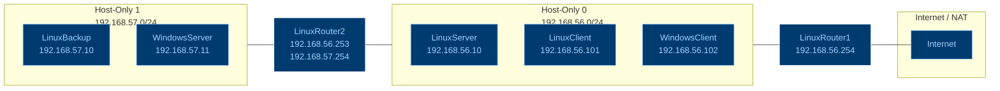

## Distribución de red
| **Equipo**                   | **Dirección IP** |
| ---------------------------- | ---------------- |
| `LinuxBackup`                | 192.168.57.10    |
| `WindowsServer`              | 192.168.57.11    |
| `LinuxServer`                | 192.168.56.10    |
| `LinuxClient`                | 192.168.56.101   |
| `WindowsClient`              | 192.168.56.102   |
| `LinuxRouter2 (Host-Only 0)` | 192.168.56.253   |
| `LinuxRouter2 (Host-Only 1)` | 192.168.57.254   |
| `LinuxRouter1 (Host-Only 0)` | 192.168.56.254   |

De esta forma nos queda una red de esta forma:

```mermaid
flowchart RL

    %% =========================
    %% INTERNET / NAT
    %% =========================
    subgraph NAT["Internet / NAT"]
        INTERNET["Internet"]
    end

    %% =========================
    %% ROUTER 1
    %% =========================
    R1["LinuxRouter1"<br/>192.168.56.254]
	
    %% =========================
    %% HOST-ONLY 0
    %% =========================
    subgraph RED56["Host-Only 0<br/>192.168.56.0/24"]
        direction TB

        LS["LinuxServer<br/>192.168.56.10"]
        LC["LinuxClient<br/>192.168.56.101"]
        WC["WindowsClient<br/>192.168.56.102"]
    end

    %% =========================
    %% ROUTER 2
    %% =========================
    R2["LinuxRouter2<br/>192.168.56.253<br/>192.168.57.254"]

    %% =========================
    %% HOST-ONLY 1
    %% =========================
    subgraph RED57["Host-Only 1<br/>192.168.57.0/24"]
        direction TB

        LB["LinuxBackup<br/>192.168.57.10"]
        WS["WindowsServer<br/>192.168.57.11"]
    end

    %% =========================
    %% CONNECTIONS
    %% =========================
    INTERNET --- R1
    R1 --- RED56
    RED56 --- R2
    R2 --- RED57

    %% =========================
    %% STYLES
    %% =========================
    classDef device fill:#003b6f,stroke:#8fc7ff,color:#9fd0ff,stroke-width:1px;
    classDef router fill:#003b6f,stroke:#ffffff,color:#9fd0ff,stroke-width:1px;
    classDef network fill:#222222,stroke:#aaaaaa,color:#ffffff,stroke-width:1px;

    class INTERNET,LS,LC,WC,LB,WS device;
    class R1,R2 router;
```

Vamos a explicar la configuración de las máquinas `LinuxRouter` exhaustivamente y de las demás de forma genérica.
#### `LinuxRouter1`
Configurar la tarjeta de red
`/etc/network/interfaces`:
```
auto enp0s8
iface enp0s8 inet static 
	address 192.168.56.254
	netmask 255.255.255.0
```
Habilitar `port-forwarding` para el reenvio de paquetes
```bash
sudo sysctl -w net.ipv4.ip_forward=1
```

para que se mantenga:
```bash
echo "net.ipv4.ip_forward=1" | sudo tee /etc/sysctl.d/99-ip-forward.conf
sudo /sbin/sysctl -p /etc/sysctl.d/99-ip-forward.conf
sudo sysctl net.ipv4.ip_forward # para comprobar que nos sale a 1
```

Aplicar las iptables que dice la practica:

Primero hay que instalar iptables porque no la tenemos  
```bash
sudo apt update && sudo apt install iptables iptables-persistent -y
```

```bash
iptables -t nat -A <POSTROUTING> -o enp0s3 -j <MASQUERADE>
```

Por ultimo tenemos que guardar la regla para que quede persistente si rebooteamos
```bash
sudo netfilter-persistent save
sudo cat /etc/iptables/rules.v4
```

#### `LinuxRouter2`
Configurar la tarjeta de red
`/etc/network/interfaces`:
```
auto enp0s3
iface enp0s3 inet static
        address 192.168.56.253
        netmask 255.255.255.0
        gateway 192.168.56.254
auto enp0s8
iface enp0s8 inet static
        address 192.168.57.254
        netmask 255.255.255.0
```

Activamos `port-forwarding`:
```bash
echo "net.ipv4.ip_forward=1" | sudo tee /etc/sysctl.d/99-ip-forward.conf
sudo /sbin/sysctl -p /etc/sysctl.d/99-ip-forward.conf
```
Hacemos la comprobación:
```bash
sudo sysctl net.ipv4.ip_forward # para comprobar que nos sale a 1
```

#### `Linux`:
En las máquinas `linux` para cambiar la `ip` y mantenerla de forma estática haremos:
`/etc/network/interfaces`
```
auto enp0s3
iface enp0s3 inet static
    address 192.168.56.10
    netmask 255.255.255.0
    gateway 192.168.56.254
    dns-nameservers 8.8.8.8 1.1.1.1
```

#### `Windows`:
```powershell
New-NetIPAddress -InterfaceAlias "Ethernet" -IPAddress "192.168.57.11" -PrefixLength 24 -DefaultGateway "192.168.56.254"
Set-DnsClientServerAddress -InterfaceAlias "Ethernet" -ServerAddresses 8.8.8.8,1.1.1.1
```

Para poner la red en privado:
```powershell
Get-NetConnectionProfile
Set-NetConnectionProfile -InterfaceAlias "Ethernet" -NetworkCategory Private
```

## Configuración SSH para todas las VMs
Tenemos que hacer la instalacion de `Openssh` para las maquinas `windows`. Es lo que explicaremos ahora y después ya nos centraremos en los siguientes aspectos de la práctica.
#### Windows ssh config
Para instalar `OpenSSH`:
```powershell
add-windowscapability -online -name OpenSSH.server
``` 

Después iniciamos el servicio y comprobamos que funciona:
```powershell
Start-Service sshd
Get-Service sshd
Set-Service -Name sshd -StartupType Automatic
Get-NetTCPConnection -LocalPort 22
```
Hacemos las comprobaciones y aseguramos que lo hemos hecho bien.
#### Configuración de SSH
[[Configuración SI SSH]]
En este archivo explicamos que hacer desde la maquina SI
## Reconfiguraciones de practicas anteriores
Como en practicas anteriores hemos hecho unas configuraciones ahora solo tenemos que cambiar ligeramente algunas cosas que ya hemos hecho anteriormente.
#### `RSYSLOG`
En todos los `linux` menos en `LinuxServer` tenemos que modificar este fichero y cambiar la `ip`: `/etc/rsyslog.d/01-remoto.conf` añadimos la `ip` de `LinuxBackup` nueva

Para que funcione el servicio y coja la configuración que queremos:
```bash
sudo systemctl restart rsyslog
```

Para comprobar que funciona otra vez:
```bash
logger "Prueba rsyslog hacia LinuxBackup tras resegmentacion"
```

#### ACTIVAR ADMINISTRADOR
```powershell
Enable-LocalUser -Name "Administrador"  
```

```powershell
Set-LocalUser -Name "palangana2026.ABC" -Password $Password
```
#### QUITAR ICMP DEL FIREWALL WINDOWS
Meter eso en los dos Windows para que nos permite los pings
```powershell
Enable-NetFirewallRule -Name "FPS-ICMP4-ERQ-In"
```
Hacemos esto para poder hacer ping a la maquina. Y saber que ya está running
#### NFS
Modificar en `LinuxServer`:
`/etc/exports`:
```powershell
/srv/nfs/share 192.168.56.0/24(rw,sync,no_subtree_check) 192.168.57.0/24(rw,sync,no_subtree_check)
```

Hacemos la prueba desde `LinuxClient` por ejemplo 
```powershell
sudo mkdir -p /mnt/nfs_share
sudo mount -t nfs 192.168.56.10:/srv/nfs/share /mnt/nfs_share
df -h /mnt/nfs_share
```
hacemos una prueba de escritura:
```powershell
touch /mnt/nfs_share/prueba_escritura.txt
```
y comprobar que se crea en `LinuxBackup`

## `NXLog`
El equipo `windowsserver` deberá configurarse para enviar los registros de eventos del sistema al servidor centralizado de logs. Para ello deberemos instalar el programa libre `NXLog Community Edition`.
Creamos un directorio para almacenar temporalmente el instalador:

```powershell
$New-Item -ItemType Directory -Path C:\Temp\NXLog -Force
```
Posteriormente comprobamos que existía:
```powershell
$Test-Path "C:\Temp\NXLog"
```
Resultado: `True`

Descargamos el instalador de `NXLog Community Edition` dentro de `C:\Temp\NXLog`
La instalación se realizó mediante `msiexec` en modo silencioso:
```powershell
$msiexec /i "C:\Temp\NXLog\nxlog-ce-3.2.2329.msi" /qn /norestart
```

Después comprobamos que el archivo de configuración había sido instalado:
```powershell
$Test-Path "C:\Program Files\nxlog\conf\nxlog.conf"
```
Resultado: `True`

También comprobamos el servicio:
```powershell
Get-Service nxlog
```
Resultado:
```
Status   Name    DisplayName

------   ----    -----------

Running  nxlog   nxlog
```

Modificamos el fichero `C:\Program Files\nxlog\conf\nxlog.conf`  
Lo que tenemos que modificar es el final del archivo
```powershell
<Extension _syslog>

    Module      xm_syslog

</Extension>  
<Input in>

    Module  im_msvistalog

</Input>

<Output out>

    Module      om_tcp

    Host        192.168.57.10

    Port        513

    Exec        to_syslog_ietf();

</Output>  
<Route windows_to_linux>

    Path    in => out

</Route>
```
Reiniciamos el servicio:  
```powershell
$Restart-Service nxlog
```
Comprobamos nuevamente la conectividad:
```powershell
$Test-NetConnection 192.168.57.10 -Port 513
```
Resultado: `TcpTestSucceeded : True`

Finalmente realizamos una prueba generando un evento desde `windowsserver`. Se utilizó:
```powershell
eventcreate /T INFORMATION /ID 1000 /L APPLICATION /SO NXLogTest /D "Prueba de envio de logs desde WindowsServer mediante NXLog"
```
Después comprobamos en `linuxbackup` los archivos modificados recientemente y se generan.

## Servicio de actualizaciones mediante línea de comandos
#### `windowsserver`
Configurar el sistema `WindowsServer` para poder gestionar las actualizaciones de Windows desde una terminal, incluyendo la posibilidad de ejecutar el proceso mediante una conexión `ssh`.
Además, en los equipos destinados a funcionar como servidores, el enunciado establece que las actualizaciones **no deben ejecutarse periódicamente**, sino que deben realizarse únicamente de forma manual.

Para ello se utilizará:
- `PowerShell`
- Módulo `PSWindowsUpdate`
- `schtasks.exe`
- Una tarea programada ejecutada con la cuenta SYSTEM.

###### **Instalación de `PSWindowsUpdate`**
El módulo utilizado para gestionar Windows Update desde PowerShell es `PSWindowsUpdate`.
La instalación se realizó mediante:
```powershell
$Install-Module PSWindowsUpdate -Force
```
Posteriormente se importó el módulo:
```powershell
$Import-Module PSWindowsUpdate
```
Para comprobar que el módulo está instalado:
```powershell
$Get-Module -ListAvailable PSWindowsUpdate
```
Resultado obtenido:
```
ModuleType Version    Name

Binary     2.2.1.5    PSWindowsUpdate
```
Por tanto, el módulo `PSWindowsUpdate` está correctamente instalado en `windowsserver`.
###### **Comprobación de `Windows Update` desde `PowerShell`**
Una vez instalado el módulo, se puede consultar `Windows Update` desde `PowerShell` mediante:
```powershell
$Get-WindowsUpdate
```
Este comando permite **consultar las actualizaciones** disponibles en el sistema.
Para instalar las actualizaciones se utiliza:
```powershell
$Install-WindowsUpdate -AcceptAll
```
Durante las pruebas se utilizó también:
```powershell
$Install-WindowsUpdate -AcceptAll -IgnoreReboot
```
El parámetro `-AcceptAll` permite aceptar todas las actualizaciones encontradas sin solicitar confirmación individual.
El parámetro `-IgnoreReboot` evita que el proceso reinicie automáticamente el equipo durante las pruebas.

###### **Creación del script de actualización**
Para evitar problemas de comillas y comandos complejos al ejecutar `PowerShell` desde `schtasks.exe`, se creó un script independiente.
Se creó el directorio:
```powershell
$mkdir C:\Scripts
```
Y el archivo:
```powershell
C:\Scripts\updatewindows.ps1
```
Contenido del script:
```powershell
$Import-Module PSWindowsUpdate
$Install-WindowsUpdate -AcceptAll -IgnoreReboot
```
Se comprobó posteriormente su contenido mediante:
```powershell
$Get-Content C:\Scripts\updatewindows.ps1
```
El resultado confirmó que el script contiene los comandos necesarios para importar `PSWindowsUpdate` y ejecutar las actualizaciones.

###### **Creación de la tarea programada**
El objetivo de la tarea es permitir que el proceso de actualización pueda ejecutarse bajo una cuenta con los permisos necesarios, independientemente de la sesión SSH del usuario.
La tarea se creó mediante:
```powershell
$schtasks.exe /create /tn "updatewindows" /sc once /st 23:59 /ru SYSTEM /tr "powershell.exe -NoProfile -ExecutionPolicy Bypass -File C:\Scripts\updatewindows.ps1"
```
**Parámetros utilizados**:

| **Parámetro**       | **Función**                                      |
| ------------------- | ------------------------------------------------ |
| /créate             | Crea una nueva tarea programada                  |
| /tn "updatewindows" | Nombre de la tarea                               |
| /sc once            | Configura una programación de una sola ejecución |
| /st 23:59           | Establece una hora válida para la programación   |
| /ru SYSTEM          | Ejecuta la tarea como SYSTEM                     |
| /tr                 | Define el programa que debe ejecutarse           |

La tarea **no se configura de forma periódica** porque el servidor debe actualizarse únicamente bajo demanda.

###### **Comprobación de la tarea**
La configuración se comprobó mediante:
```powershell
$schtasks.exe /query /tn "updatewindows" /fo LIST /v
```
Entre los valores obtenidos destacan:
```
Estado de tarea programada: Habilitado
Ejecutar como usuario:      SYSTEM
Tipo de programación:       Solo una vez
Repetir: cada:              Deshabilitado
```
Esto demuestra que:
1. La tarea está habilitada.
2. Se ejecuta con la cuenta SYSTEM.
3. No existe una programación periódica.
4. Cumple el requisito establecido para los servidores.

###### **Ejecución manual mediante /run**
El enunciado establece que en los servidores las actualizaciones deben realizarse **manualmente**.
Para ello se utilizó:
```powershell
$schtasks.exe /run /tn "updatewindows"
```
Este comando permite iniciar inmediatamente la tarea programada sin esperar a la hora establecida en su programación. De esta forma, la actualización puede iniciarse desde una conexión SSH utilizando únicamente la línea de comandos.

###### **Comprobación de la ejecución**
Después de ejecutar:
```powershell
$schtasks.exe /run /tn "updatewindows"
```
se comprobó que la tarea había comenzado a ejecutarse mediante:
```powershell
$schtasks.exe /query /tn "updatewindows" /fo LIST /v
```
Durante la ejecución se observó:
```
Estado: En ejecución
Ejecutar como usuario: SYSTEM
```
También se comprobó que los procesos necesarios de `Windows Update` estaban activos:
```powershell
$Get-Service wuauserv,bits
```
Resultado:
```
Status   Name
Running  bits
Running  wuauserv
```
Esto confirma que tanto `BITS` como `Windows Update` estaban funcionando durante el proceso.

###### **Verificación de las actualizaciones instaladas**
Finalmente, se comprobó el historial de `Windows Update`:
```powershell
$Get-WUHistory | Select-Object -First 5
```
Se obtuvieron varias operaciones con resultado: `Succeeded`
Entre ellas aparecieron instalaciones realizadas a las `10:08`, `10:11` y `10:12` del `01/10/2026`.
Por tanto, se pudo comprobar que la ejecución de la tarea no se limitó a iniciar PowerShell, sino que el proceso de `PSWindowsUpdate` realizó correctamente instalaciones de actualizaciones.

#### `windowsclient1`
Para poder gestionar `Windows Update` desde PowerShell se utiliza el módulo `PSWindowsUpdate`.
La instalación se realizó mediante:
```powershell
$Install-Module PSWindowsUpdate -Force
```
Durante la instalación apareció la siguiente advertencia:
La versión "2.2.1.5" del módulo "PSWindowsUpdate" se encuentra actualmente en uso.
Esta advertencia indicaba que el módulo ya estaba instalado y siendo utilizado por la sesión actual.
Se comprobó su instalación mediante:
```powershell
$Get-Module -ListAvailable PSWindowsUpdate
```
Obteniéndose:
```powershell
ModuleType Version    Name

---------- -------    ----

Binary     2.2.1.5    PSWindowsUpdate
```
Por tanto, el módulo quedó correctamente disponible en `WindowsClient`.

###### **Creación del script de actualización**
Para ejecutar el proceso de actualización mediante una tarea programada se creó un script de `PowerShell`.
Se utilizó el directorio: `C:\Scripts`
Y el script: `C:\Scripts\updatewindows.ps1`
El contenido del script es:
```powershell
$Import-Module PSWindowsUpdate
$Install-WindowsUpdate -AcceptAll -IgnoreReboot
```
**Función del script**:

La primera línea: `Import-Module PSWindowsUpdate`
carga el módulo necesario para poder utilizar los comandos de `Windows Update`.

La segunda: `Install-WindowsUpdate -AcceptAll -IgnoreReboot`
inicia la instalación de las actualizaciones disponibles.
El parámetro `-AcceptAll` permite aceptar automáticamente las actualizaciones encontradas.
El parámetro `-IgnoreReboot` evita que el equipo se reinicie automáticamente durante la ejecución del proceso.

El contenido se comprobó mediante:
```powershell
$Get-Content C:\Scripts\updatewindows.ps1
```

###### **Creación de la tarea programada**
>En los equipos de usuarios, el enunciado establece que las actualizaciones deben ejecutarse automáticamente a una hora determinada y con una frecuencia de al menos una vez por semana.

Se decidió configurar la tarea para ejecutarse:
- **Día:** domingo.
- **Hora:** 03:00.
- **Frecuencia:** semanal.

La tarea se creó de esta forma:
```powershell
$schtasks.exe /create /tn "updatewindows" /sc weekly /d SUN /st 03:00 /ru SYSTEM /tr "powershell.exe -NoProfile -ExecutionPolicy Bypass -File C:\Scripts\updatewindows.ps1"
```

**Parámetros utilizados**

|**Parámetro**|**Función**|
|---|---|
|/create|Crea la tarea programada|
|/tn "updatewindows"|Define el nombre de la tarea|
|/sc weekly|Establece una frecuencia semanal|
|/d SUN|Ejecuta la tarea los domingos|
|/st 03:00|Establece la hora de ejecución|
|/ru SYSTEM|Ejecuta la tarea como SYSTEM|
|/tr|Define el programa que debe ejecutarse|

El uso de `/sc` weekly permite cumplir el requisito de ejecutar las actualizaciones automáticamente al menos una vez por semana.

###### **Comprobación de la configuración**

Una vez creada la tarea, se comprobó su configuración:
```powershell
$schtasks.exe /query /tn "updatewindows" /fo LIST /v
```
Estos datos permiten comprobar que la tarea ha quedado configurada para ejecutarse automáticamente **todos los domingos a las 03:00**.

###### **Prueba manual de la tarea**
Aunque en `WindowsClient` la tarea debe ejecutarse automáticamente según su programación, se realizó una prueba manual para verificar que la tarea funciona correctamente sin necesidad de esperar a la primera ejecución programada.

Se utilizó:
```powershell
$schtasks.exe /run /tn "updatewindows"
```

El sistema respondió: `CORRECTO: se ha intentado ejecutar la tarea programada "updatewindows".`

Esta prueba permitió comprobar que el Programador de tareas puede iniciar correctamente el script asociado.

La utilización de `/run` en esta prueba **no modifica la programación semanal** de la tarea. Simplemente inicia manualmente una ejecución adicional para comprobar su funcionamiento.

###### **Verificación de las actualizaciones**
Después de ejecutar manualmente la tarea se comprobó el historial de `Windows Update`:
```powershell
$Get-WUHistory | Select-Object -First 5
```
El resultado mostró varias instalaciones que verificaban que era correcta la instalación.

#### `linuxserver` `linuxbackup` `linuxclient`
Estos dispositivos fueron configurados en la practica anterior.
## Instalación y configuración de IIS
Para ello deberemos instalar esto:
```powershell
Install-WindowsFeature Web-Server,Web-CGI
```
Comprobamos que hemos instalado bien:
```powershell
PS C:\Users\administrador> Get-WindowsFeature Web-Server, Web-CGI   

Display Name                                            Name                       Install State
------------                                            ----                       -------------
[X] Servidor web (IIS)                                  Web-Server                     Installed
            [X] CGI                                     Web-CGI                        Installed

```

#### `php`
Descargamos `php`:
```powershell
Invoke-WebRequest `
-Uri "https://downloads.php.net/~windows/releases/archives/php-8.5.10-nts-Win32-vs17-x64.zip" `
-OutFile "$env:TEMP\php.zip"
```

Creamos el directorio `C:\PHP`:
```powershell
New-Item -ItemType Directory -Path C:\PHP -Force
```
Y descomprimimos:
```powershell
Expand-Archive `
  -Path "$env:TEMP\php.zip" `
  -DestinationPath C:\PHP `
  -Force
```
Comprobamos que tenemos el ejecutable:
```powershell
Test-Path C:\PHP\php-cgi.exe
```
Nos devuelve `True`

Le damos permisos a `IIS`:
```powershell
icacls C:\PHP /grant "IIS_IUSRS:(OI)(CI)(RX)" /T
```
Comprobar `AppCmd`
```powershell
Test-Path C:\Windows\System32\inetsrv\appcmd.exe
```
Devuelve: `True`

Una dependencia clave para esto es `Microsoft Visual C++`, por lo tanto, lo descargamos:
```powershell
Invoke-WebRequest "https://aka.ms/vc14/vc_redist.x64.exe" -OutFile "$env:TEMP\vc_redist.x64.exe"
```
Una vez descargado lo instalamos:
```powershell
Start-Process "$env:TEMP\vc_redist.x64.exe" -ArgumentList "/install /quiet /norestart" -Wait
```
y comprobamos que está bien instalado:
```powershell
Get-ItemProperty `
  "HKLM:\SOFTWARE\Microsoft\Windows\CurrentVersion\Uninstall\*" `
  -ErrorAction SilentlyContinue |
Where-Object { $_.DisplayName -like "*Visual C++*" } |
Select-Object DisplayName, DisplayVersion
```

Registrar `php-cgi.exe` como `FastCGI`:
```powershell
$appcmd = "C:\Windows\System32\inetsrv\appcmd.exe"
```

```powershell
& $appcmd set config /section:system.webServer/fastCgi /+"[fullPath='C:\PHP\php-cgi.exe']"
& $appcmd list config /section:system.webServer/fastCgi
```

Crear el handler para los `.php`:
```powershell
& $appcmd unlock config /section:system.webServer/handlers
```
Primero los desbloqueamos y después modificamos lo que nos pide el enunciado
```powershell
& $appcmd set config "Default Web Site" /section:system.webServer/handlers /+"[name='PHP-FastCGI',path='*.php',verb='*',modules='FastCgiModule',scriptProcessor='C:\PHP\php-cgi.exe',resourceType='File']"
```
Comprobamos:
```powershell
<system.webServer>
  <handlers accessPolicy="Read, Script">
    <add name="PHP-FastCGI" path="*.php" verb="*" modules="FastCgiModule" scriptProcessor="C:\PHP\php-cgi.exe" resourceType="File" />
    <add name="CGI-exe" path="*.exe" verb="*" modules="CgiModule" resourceType="File" requireAccess="Execute" allowPathInfo="true" />
    <add name="TRACEVerbHandler" path="*" verb="TRACE" modules="ProtocolSupportModule" requireAccess="None" />
    <add name="OPTIONSVerbHandler" path="*" verb="OPTIONS" modules="ProtocolSupportModule" requireAccess="None" />
    <add name="StaticFile" path="*" verb="*" modules="StaticFileModule,DefaultDocumentModule,DirectoryListingModule" resourceType="Either" requireAccess="Read" />
  </handlers>
</system.webServer>
```

Hacemos un script de prueba:
```powershell
@"
<?php
phpinfo();
?>
"@ | Set-Content C:\inetpub\wwwroot\info.php
```
y lo probamos:
```powershell
Invoke-WebRequest http://localhost/info.php -UseBasicParsing
```
Nos devuelve el `status` de la conexión los `headers` y más.
Entonces ya tenemos instalado `php`:
- [x]  IIS instalado
- [x]  Web-CGI instalado
- [x]  PHP instalado
- [x]  `php-cgi.exe` funciona
- [x]  FastCGI configurado
- [x]  `FastCgiModule`
- [x]  Handler `*.php`
- [x]  `scriptProcessor → C:\PHP\php-cgi.exe`
- [x]  PHP ejecutándose correctamente desde IIS

## Publicación de la pagina Web
#### `Windowsserver`
Para  acceder al servidor `Samba` donde descargamos las `ISOs`
```powershell
net view \\10.6.24.100
```
Una vez vemos lo que hay dentro accedemos a la carpeta que nos interesa:
```powershell
Copy-Item \\10.6.24.100\ISOs\web.zip C:\Temp\web.zip
```
Una vez descargado:
```powershell
Expand-Archive C:\Temp\web.zip -DestinationPath C:\inetpub\wwwroot\web -Force
```
Vemos su contenido:
```powershell
Get-ChildItem C:\inetpub\wwwroot\web
```
Para que `IIS` pueda actualizar los logs:
```powershell
icacls C:\inetpub\wwwroot\web\data /grant "IIS_IUSRS:(OI)(CI)(M)" /T
```
`M` Modify → lectura, escritura, modificación y ejecución.
`(OI)(CI)` = se hereda a archivos y subdirectorios.
`/T` = recursivamente.

Accedemos desde la máquina `SI` y vemos que la web que solicitamos funciona en `192.168.57.11/web/index.php`

#### `linuxserver`
###### Descarga y transferencia
Desde el host de la universidad se descargó `web.zip` del recurso Samba `ISOs`:
```bash
smbclient //10.6.24.100/ISOs -N 
get web.zip
```
Se transfirió a `LinuxServer` mediante el alias `ssh` configurado:
```bash
scp ~/web.zip linuxserver:/home/dummyadmin/
```
###### Preparación y despliegue en `LinuxServer`
Se instalaron `unzip` para extraer la aplicación y `curl` para comprobar el servicio HTTP:
```bash
sudo apt install unzip curl
```
Se extrajo el ZIP en un directorio temporal:
```bash
mkdir -p ~/despliegue-practica13
unzip ~/web.zip -d ~/despliegue-practica13
```
La aplicación contiene código PHP, plantillas HTML, imágenes y archivos JSON. Se identificaron operaciones de escritura en `data/`, `images/pakemon/` e `images/fotos/`.

Se conservó una copia del contenido anterior y se desplegó la aplicación en el directorio de Apache:
```bash
sudo cp -a /var/www/html /var/www/html.pre-despliegue
sudo mv /var/www/html/index.html /var/www/index-apache-original.html
sudo cp -a ~/despliegue-practica13/web/. /var/www/html/
```
Se retiró el `index.html` inicial para que se sirviera la entrada `index.php` de la aplicación.
###### Permisos
Se asignó el contenido general a `root`, con permisos de lectura para `Apache`:
```bash
sudo chown -R root:root /var/www/html
sudo find /var/www/html -type d -exec chmod 755 {} +
sudo find /var/www/html -type f -exec chmod 644 {} +
```
Se concedió a `www-data`, usuario de `Apache`, la propiedad de los directorios que requieren escritura:
```bash
sudo chown -R www-data:www-data /var/www/html/data /var/www/html/images/pakemon /var/www/html/images/fotos
```
De esta forma, `Apache` puede actualizar los datos `JSON` y guardar imágenes sin disponer de escritura sobre todo el código de la aplicación.

###### Comprobaciones
Desde el host se consultaron la página de entrada la cual funciono
```bash
curl http://192.168.56.10/index.php
```
Desde la maquina `linuxserver` se estuvo observando los logs de acceso para que funcionaba el curl anterior
```bash
dummyadmin@linuxserver:~$ sudo tail -n 0 -f /var/log/apache2/access.log
192.168.56.1 - - [06/Oct/2026:09:58:14 +0200] "GET /index.php HTTP/1.1" 200 12595 "-" "curl/8.5.0"
```

| Prueba | Resultado |
|---|---|
| Página de entrada | HTTP 200 y 12229 bytes; PHP genera el HTML del login. |
| Logo | HTTP 200 y 380007 bytes, coincidiendo con el archivo del ZIP. |
| Registro de Apache | Ambas peticiones aparecen desde el host, `192.168.56.1`. |
| Registro de la aplicación | `data/logs.json` contiene JSON válido y registra la petición a `/index.php`. |

Comprobamos que funciona el servicio desde la maquina `SI`.

## Configuración de PHP en Windows
>En este apartado se configura PHP en el `windowsserver` para controlar el tratamiento de los errores generados por las aplicaciones PHP. Se establece que los errores no sean mostrados directamente al usuario, pero que sean registrados en un fichero de log para facilitar su posterior análisis y diagnóstico.

La configuración solicitada es:
```
[PHP]
display_errors = Off
log_errors = On
error_log = "c:\windows\temp\php_errors.log"
```

De esta forma, los errores de PHP quedan ocultos para el usuario final, pero son almacenados en:
```
C:\Windows\Temp\php_errors.log
```

#### Localización de `PHP`
PHP se encuentra instalado en:
```
C:\PHP
```
Se comprueba que el ejecutable de PHP está disponible:
```
Test-Path C:\PHP\php-cgi.exe
```

El resultado obtenido es:
```
True
```

También se puede comprobar directamente la versión instalada:
```
C:\PHP\php-cgi.exe -v
```

#### Configuración del archivo `php.ini`
Se comprueba inicialmente si existe el fichero de configuración:
```powershell
Test-Path C:\PHP\php.ini
```

En caso de que no exista, se puede crear a partir del fichero de configuración de desarrollo incluido con PHP:
```powershell
Copy-Item C:\PHP\php.ini-development C:\PHP\php.ini
```

Una vez disponible `php.ini`, se configuran los parámetros relacionados con la gestión de errores.
Los valores que deben quedar establecidos son:
```
display_errors = Off
log_errors = On
error_log = "c:\windows\temp\php_errors.log"
```

Para comprobar los valores configurados en el fichero:
```powershell
Select-String -Path C:\PHP\php.ini -Pattern "display_errors|log_errors|error_log"
```
El resultado debe mostrar los parámetros configurados con los valores indicados anteriormente.

#### Permisos sobre el directorio de logs
El proceso PHP se ejecuta mediante IIS/FastCGI, por lo que es necesario garantizar que la cuenta utilizada por IIS pueda escribir en el directorio donde se almacenará el registro.
Se conceden permisos de modificación al grupo `IIS_IUSRS` sobre `C:\Windows\Temp`:
```powershell
icacls C:\Windows\Temp /grant "IIS_IUSRS:(OI)(CI)(M)"
```
Los parámetros utilizados tienen el siguiente significado:

- `IIS_IUSRS`: grupo de usuarios utilizado por IIS.
- `(OI)`: los permisos se heredan por los archivos.
- `(CI)`: los permisos se heredan por los subdirectorios.
- `(M)`: permiso de modificación.
Se pueden comprobar posteriormente los permisos mediante:
```powershell
icacls C:\Windows\Temp
```

#### Comprobación de la configuración efectiva de PHP
Para comprobar que PHP está utilizando realmente los valores configurados en `php.ini`, se ejecuta:
```powershell
C:\PHP\php-cgi.exe -i | Select-String "display_errors|log_errors|error_log"
```

Se obtiene:
```
<tr><td class="e">display_errors</td><td class="v">Off</td><td class="v">Off</td></tr>
<tr><td class="e">error_log</td><td class="v">c:\windows\temp\php_errors.log</td><td class="v">c:\windows\temp\php_errors.log</td></tr>
<tr><td class="e">error_log_mode</td><td class="v">0644</td><td class="v">0644</td></tr>
<tr><td class="e">log_errors</td><td class="v">On</td><td class="v">On</td></tr>
```

Los valores obtenidos confirman que:
```
display_errors = Off
log_errors = On
error_log = c:\windows\temp\php_errors.log
```
Por tanto, PHP ha cargado correctamente la configuración.

#### Reinicio de IIS
Después de modificar la configuración de PHP, se reinicia IIS para garantizar que los procesos de PHP utilizados por FastCGI carguen la nueva configuración:
```powershell
iisreset
```

El comando debe finalizar indicando que los servicios de IIS se han reiniciado correctamente.
También se puede comprobar que el servicio de IIS se encuentra activo mediante:
```powershell
Get-Service W3SVC
```
El estado esperado es:
```
Status   Name   DisplayName
------   ----   -----------
Running  W3SVC  World Wide Web Publishing Service
```

#### Comprobación del funcionamiento de la aplicación web
Una vez configurado PHP, se comprueba que la aplicación web continúa funcionando correctamente.
Desde `PowerShell` se realiza una petición a la aplicación:
```powershell
Invoke-WebRequest http://localhost/web/index.php -UseBasicParsing
```
La respuesta obtenida presenta:
```
StatusCode        : 200
StatusDescription : OK
```
El código HTTP `200` confirma que IIS ha podido procesar correctamente la petición y ejecutar la aplicación PHP.
Es importante comprobar que, aunque existan errores o warnings de PHP, estos no se muestran directamente al usuario debido a:
```
display_errors = Off
```

#### Comprobación del fichero de registro
Se comprueba si PHP ha creado el fichero de log:
```powershell
Test-Path C:\Windows\Temp\php_errors.log
```
El resultado obtenido es:
```
True
```

A continuación se consulta su contenido:
```powershell
Get-Content C:\Windows\Temp\php_errors.log
```
Se obtuvieron los siguientes registros:
```
[07-Oct-2026 08:10:42 UTC] PHP Warning:  Undefined array key "logout" in C:\inetpub\wwwroot\web\index.php on line 8
[07-Oct-2026 08:10:42 UTC] PHP Warning:  Undefined array key "type" in C:\inetpub\wwwroot\web\index.php on line 17
[07-Oct-2026 08:10:42 UTC] PHP Warning:  Undefined array key "type" in C:\inetpub\wwwroot\web\index.php on line 21
```

Estos mensajes corresponden a advertencias generadas durante la ejecución de la aplicación.
También se puede utilizar el siguiente comando para visualizar el fichero de log en tiempo real:
```powershell
Get-Content C:\Windows\Temp\php_errors.log -Wait
```
De esta forma, cualquier nuevo error generado por PHP aparecerá automáticamente en la consola.

#### Resultado
La configuración realizada permite separar la información mostrada al usuario de la información destinada al administrador del sistema.
El funcionamiento final es:
```
                 Petición HTTP
                       │
                       ▼
                    IIS/PHP
                       │
                ┌──────┴──────┐
                │             │
          display_errors   log_errors
              Off              On
                │               │
                ▼               ▼
        No mostrar error   php_errors.log
        al usuario         C:\Windows\Temp\
                           php_errors.log
```
La configuración queda validada mediante tres comprobaciones:
1. `display_errors` aparece configurado como `Off`.
2. `log_errors` aparece configurado como `On` y `error_log` apunta a `C:\Windows\Temp\php_errors.log`.
3. La aplicación genera warnings que no se muestran al usuario y que quedan registrados en el fichero de log.

Por tanto, se cumple la configuración solicitada en el enunciado para la gestión de errores de PHP en el servidor Windows.

## Configuración de PHP en Linux
En este apartado se configura PHP en el `linuxserver` para controlar la visualización y el registro de errores generados por las aplicaciones web.

El objetivo es utilizar la misma configuración establecida en el servidor Windows: los errores de PHP no deben mostrarse directamente al usuario, pero sí deben quedar registrados en un fichero de log para poder analizarlos posteriormente.

La configuración utilizada es:
```
display_errors = Off
log_errors = On
error_log = /var/log/php_errors.log
```

De esta forma, los errores de PHP se almacenan en:
```
/var/log/php_errors.log
```

#### Comprobación de la instalación de PHP
Se comprueba que PHP está instalado correctamente mediante:
```bash
php -v
```

También se comprueba la ubicación de la configuración utilizada por PHP:
```bash
php --ini
```

Inicialmente este comando muestra:
```
Loaded Configuration File: /etc/php/8.4/cli/php.ini
```

Este fichero corresponde a la configuración de PHP para la línea de comandos. Puesto que la aplicación web se ejecuta mediante Apache, es necesario utilizar la configuración de PHP correspondiente al módulo de Apache.

Se comprueba que existe dicho fichero:
```bash
ls -l /etc/php/8.4/apache2/php.ini
```

El fichero utilizado para configurar PHP en el servidor web es:
```
/etc/php/8.4/apache2/php.ini
```

#### Configuración de `php.ini`
Se edita el fichero de configuración de PHP utilizado por Apache:
```bash
sudo nano /etc/php/8.4/apache2/php.ini
```

Dentro del fichero se localizan los parámetros relacionados con la gestión de errores y se establecen los siguientes valores:
```
display_errors = Off
log_errors = On
error_log = /var/log/php_errors.log
```

La configuración tiene el siguiente comportamiento:
- `display_errors = Off`: evita que los errores de PHP se muestren directamente en la página web.
- `log_errors = On`: activa el registro de errores.
- `error_log = /var/log/php_errors.log`: establece el fichero donde se almacenarán los errores.
#### Creación del fichero de log
Se crea el fichero destinado a almacenar los errores de `PHP`:
```bash
sudo touch /var/log/php_errors.log
```

Como Apache necesita poder escribir en este fichero, se asigna su propiedad al usuario utilizado por el servidor web, `www-data`:
```bash
sudo chown www-data:www-data /var/log/php_errors.log
```

Se establecen permisos para permitir que el propietario pueda leer y escribir en el fichero:
```bash
sudo chmod 640 /var/log/php_errors.log
```

Los permisos pueden comprobarse mediante:
```bash
ls -l /var/log/php_errors.log
```

El fichero debe aparecer con el usuario y grupo `www-data`:
```
-rw-r----- 1 www-data www-data ... /var/log/php_errors.log
```

#### Reinicio de Apache
Una vez modificada la configuración de PHP, se reinicia `Apache` para que el servidor web cargue los nuevos parámetros:
```bash
sudo systemctl restart apache2
```

Se comprueba que Apache continúa funcionando correctamente:
```bash
systemctl status apache2 --no-pager
```

El servicio debe encontrarse en estado:
```
Active: active (running)
```

#### Comprobación de la configuración mediante Apache
Para comprobar que la configuración utilizada por PHP desde Apache es la correcta, se crea temporalmente una página `phpinfo()`.

Se crea el fichero:
```bash
echo '<?php phpinfo(); ?>' | sudo tee /var/www/html/info.php
```

A continuación, desde un navegador web se accede a:
```
http://192.168.56.10/info.php
```

En la página generada por `phpinfo()` se comprueban los parámetros:
```
display_errors
log_errors
error_log
```

Los valores deben ser:
```
display_errors    Off
log_errors        On
error_log         /var/log/php_errors.log
```

Esta comprobación permite verificar que la configuración utilizada realmente por PHP al ejecutarse mediante Apache coincide con la configuración establecida en:
```
/etc/php/8.4/apache2/php.ini
```

#### Comprobación del fichero de errores
Se consulta el contenido del fichero de registro mediante:
```bash
sudo tail -f /var/log/php_errors.log
```

El comando `tail -f` permite visualizar en tiempo real las nuevas entradas que PHP vaya añadiendo al fichero.

Si la aplicación genera algún `warning` o `error`, este debe aparecer en:
```text
/var/log/php_errors.log
```

y no debe mostrarse directamente al usuario debido a:
```ini
display_errors = Off
```

#### Eliminación del fichero de prueba
Una vez terminada la comprobación, se elimina el fichero `info.php`.

Esto es importante porque `phpinfo()` muestra información detallada sobre la configuración del servidor y no debe dejarse accesible innecesariamente.
```bash
sudo rm /var/www/html/info.php
```

#### Resultado
La configuración final de PHP en el `linuxserver` queda establecida de la siguiente forma:
```ini
display_errors = Off
log_errors = On
error_log = /var/log/php_errors.log
```

El flujo de gestión de errores queda definido de la siguiente manera:
```text
              Petición HTTP
                    │
                    ▼
                 Apache
                    │
                    ▼
                   PHP
                    │
             ┌──────┴──────┐
             │             │
     display_errors     log_errors
          Off               On
             │               │
             ▼               ▼
      No mostrar error   /var/log/php_errors.log
       al usuario
```

De esta manera, los errores generados por PHP no son visibles para los usuarios de la aplicación, pero quedan almacenados en un fichero de registro accesible para el administrador del servidor.

La configuración permite además mantener un comportamiento equivalente al configurado en `windowsserver`, donde los errores se almacenan en `C:\Windows\Temp\php_errors.log`.