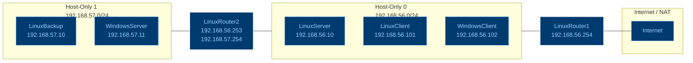

## Distribución de red
| **Equipo**                   | **Dirección IP** |
| ---------------------------- | ---------------- |
| `LinuxBackup`                | 192.168.57.10    |
| `WindowsServer`              | 192.168.57.11    |
| `LinuxServer`                | 192.168.56.10    |
| `LinuxClient`                | 192.168.56.101   |
| `WindowsClient`              | 192.168.56.102   |
| `LinuxRouter2 (Host-Only 0)` | 192.168.56.253   |
| `LinuxRouter2 (Host-Only 1)` | 192.168.57.254   |
| `LinuxRouter1 (Host-Only 0)` | 192.168.56.254   |

De esta forma nos queda una red de esta forma:

```mermaid
flowchart RL

    %% =========================
    %% INTERNET / NAT
    %% =========================
    subgraph NAT["Internet / NAT"]
        INTERNET["Internet"]
    end

    %% =========================
    %% ROUTER 1
    %% =========================
    R1["LinuxRouter1"<br/>192.168.56.254]
	
    %% =========================
    %% HOST-ONLY 0
    %% =========================
    subgraph RED56["Host-Only 0<br/>192.168.56.0/24"]
        direction TB

        LS["LinuxServer<br/>192.168.56.10"]
        LC["LinuxClient<br/>192.168.56.101"]
        WC["WindowsClient<br/>192.168.56.102"]
    end

    %% =========================
    %% ROUTER 2
    %% =========================
    R2["LinuxRouter2<br/>192.168.56.253<br/>192.168.57.254"]

    %% =========================
    %% HOST-ONLY 1
    %% =========================
    subgraph RED57["Host-Only 1<br/>192.168.57.0/24"]
        direction TB

        LB["LinuxBackup<br/>192.168.57.10"]
        WS["WindowsServer<br/>192.168.57.11"]
    end

    %% =========================
    %% CONNECTIONS
    %% =========================
    INTERNET --- R1
    R1 --- RED56
    RED56 --- R2
    R2 --- RED57

    %% =========================
    %% STYLES
    %% =========================
    classDef device fill:#003b6f,stroke:#8fc7ff,color:#9fd0ff,stroke-width:1px;
    classDef router fill:#003b6f,stroke:#ffffff,color:#9fd0ff,stroke-width:1px;
    classDef network fill:#222222,stroke:#aaaaaa,color:#ffffff,stroke-width:1px;

    class INTERNET,LS,LC,WC,LB,WS device;
    class R1,R2 router;
```

Vamos a explicar la configuración de las máquinas `LinuxRouter` exhaustivamente y de las demás de forma genérica.
#### `LinuxRouter1`
Configurar la tarjeta de red
`/etc/network/interfaces`:
```
auto enp0s8
iface enp0s8 inet static 
	address 192.168.56.254
	netmask 255.255.255.0
```
Habilitar `port-forwarding` para el reenvio de paquetes
```
sudo sysctl -w net.ipv4.ip_forward=1
```

para que se mantenga:
```
echo "net.ipv4.ip_forward=1" | sudo tee /etc/sysctl.d/99-ip-forward.conf
sudo /sbin/sysctl -p /etc/sysctl.d/99-ip-forward.conf
sudo sysctl net.ipv4.ip_forward # para comprobar que nos sale a 1
```

Aplicar las iptables que dice la practica:

Primero hay que instalar iptables porque no la tenemos  
```
sudo apt update && sudo apt install iptables iptables-persistent -y
```

```
iptables -t nat -A <POSTROUTING> -o enp0s3 -j <MASQUERADE>
```

Por ultimo tenemos que guardar la regla para que quede persistente si rebooteamos
```
sudo netfilter-persistent save
sudo cat /etc/iptables/rules.v4
```

#### `LinuxRouter2`
Configurar la tarjeta de red
`/etc/network/interfaces`:
```
auto enp0s3
iface enp0s3 inet static
        address 192.168.56.253
        netmask 255.255.255.0
        gateway 192.168.56.254
auto enp0s8
iface enp0s8 inet static
        address 192.168.57.254
        netmask 255.255.255.0
```

Activamos `port-forwarding`:
```
echo "net.ipv4.ip_forward=1" | sudo tee /etc/sysctl.d/99-ip-forward.conf
sudo /sbin/sysctl -p /etc/sysctl.d/99-ip-forward.conf
```
Hacemos la comprobación:
```
sudo sysctl net.ipv4.ip_forward # para comprobar que nos sale a 1
```

#### `Linux`:
En las máquinas `linux` para cambiar la `ip` y mantenerla de forma estática haremos:
`/etc/network/interfaces`
```
auto enp0s3
iface enp0s3 inet static
    address 192.168.56.10
    netmask 255.255.255.0
    gateway 192.168.56.254
    dns-nameservers 8.8.8.8 1.1.1.1
```

#### `Windows`:
```
New-NetIPAddress -InterfaceAlias "Ethernet" -IPAddress "192.168.57.11" -PrefixLength 24 -DefaultGateway "192.168.56.254"
Set-DnsClientServerAddress -InterfaceAlias "Ethernet" -ServerAddresses 8.8.8.8,1.1.1.1
```

Para poner la red en privado:
```
Get-NetConnectionProfile
Set-NetConnectionProfile -InterfaceAlias "Ethernet" -NetworkCategory Private
```

## Configuración SSH para todas las VMs
Tenemos que hacer la instalacion de `Openssh` para las maquinas `windows`. Es lo que explicaremos ahora y después ya nos centraremos en los siguientes aspectos de la práctica.
#### Windows ssh config
Para instalar `OpenSSH`:
```
add-windowscapability -online -name OpenSSH.server
``` 

Después iniciamos el servicio y comprobamos que funciona:
```
Start-Service sshd
Get-Service sshd
Set-Service -Name sshd -StartupType Automatic
Get-NetTCPConnection -LocalPort 22
```
Hacemos las comprobaciones y aseguramos que lo hemos hecho bien.
#### Configuración de SSH
[[Configuración SI SSH]]
En este archivo explicamos que hacer desde la maquina SI

## Reconfiguraciones de practicas anteriores
Como en practicas anteriores hemos hecho unas configuraciones ahora solo tenemos que cambiar ligeramente algunas cosas que ya hemos hecho anteriormente.
#### `RSYSLOG`
En todos los `linux` menos en `LinuxServer` tenemos que modificar este fichero y cambiar la `ip`: `/etc/rsyslog.d/01-remoto.conf` añadimos la `ip` de `LinuxBackup` nueva

Para que funcione el servicio y coja la configuración que queremos:
```
sudo systemctl restart rsyslog
```

Para comprobar que funciona otra vez:
```
logger "Prueba rsyslog hacia LinuxBackup tras resegmentacion"
```

#### ACTIVAR ADMINISTRADOR
```
Enable-LocalUser -Name "Administrador"  
```

```
Set-LocalUser -Name "palangana2026.ABC" -Password $Password
```
#### QUITAR ICMP DEL FIREWALL WINDOWS
```
Meter eso en los dos Windows para que nos permite los pings
```

```
Enable-NetFirewallRule -Name "FPS-ICMP4-ERQ-In"
```
Hacemos esto para poder hacer ping a la maquina. Y saber que ya está running

#### NFS
Modificar en `LinuxServer`:
`/etc/exports`:
```
/srv/nfs/share 192.168.56.0/24(rw,sync,no_subtree_check) 192.168.57.0/24(rw,sync,no_subtree_check)
```

Hacemos la prueba desde `LinuxClient` por ejemplo 
```
sudo mkdir -p /mnt/nfs_share
sudo mount -t nfs 192.168.56.10:/srv/nfs/share /mnt/nfs_share
df -h /mnt/nfs_share
```
hacemos una prueba de escritura:
```
touch /mnt/nfs_share/prueba_escritura.txt
```
y comprobar que se crea en `LinuxBackup`

## `NXLog`
El equipo `windowsserver` deberá configurarse para enviar los registros de eventos del sistema al servidor centralizado de logs. Para ello deberemos instalar el programa libre `NXLog Community Edition`.
Creamos un directorio para almacenar temporalmente el instalador:

```
$New-Item -ItemType Directory -Path C:\Temp\NXLog -Force
```
Posteriormente comprobamos que existía:
```
$Test-Path "C:\Temp\NXLog"
```
Resultado: `True`

Descargamos el instalador de `NXLog Community Edition` dentro de `C:\Temp\NXLog`
La instalación se realizó mediante `msiexec` en modo silencioso:
```
$msiexec /i "C:\Temp\NXLog\nxlog-ce-3.2.2329.msi" /qn /norestart
```

Después comprobamos que el archivo de configuración había sido instalado:
```
$Test-Path "C:\Program Files\nxlog\conf\nxlog.conf"
```
Resultado: `True`

También comprobamos el servicio:
```
Get-Service nxlog
```
Resultado:
```
Status   Name    DisplayName

------   ----    -----------

Running  nxlog   nxlog
```

Modificamos el fichero `C:\Program Files\nxlog\conf\nxlog.conf`  
Lo que tenemos que modificar es el final del archivo
```
<Extension _syslog>

    Module      xm_syslog

</Extension>  
<Input in>

    Module  im_msvistalog

</Input>

<Output out>

    Module      om_tcp

    Host        192.168.57.10

    Port        513

    Exec        to_syslog_ietf();

</Output>  
<Route windows_to_linux>

    Path    in => out

</Route>
```
Reiniciamos el servicio:  
```
$Restart-Service nxlog
```
Comprobamos nuevamente la conectividad:
```
$Test-NetConnection 192.168.57.10 -Port 513
```
Resultado: `TcpTestSucceeded : True`

Finalmente realizamos una prueba generando un evento desde `windowsserver`. Se utilizó:
```
eventcreate /T INFORMATION /ID 1000 /L APPLICATION /SO NXLogTest /D "Prueba de envio de logs desde WindowsServer mediante NXLog"
```
Después comprobamos en `linuxbackup` los archivos modificados recientemente y se generan.

