| **Equipo**                   | **Dirección IP** |
| ---------------------------- | ---------------- |
| `LinuxBackup`                | 192.168.57.10    |
| `WindowsServer`              | 192.168.57.11    |
| `LinuxServer`                | 192.168.56.10    |
| `LinuxClient`                | 192.168.56.101   |
| `WindowsClient`              | 192.168.56.102   |
| `LinuxRouter2 (Host-Only 0)` | 192.168.56.253   |
| `LinuxRouter2 (Host-Only 1)` | 192.168.57.254   |
| `LinuxRouter1 (Host-Only 0)` | 192.168.56.254   |

De esta forma nos queda una red de esta forma:

```mermaid
flowchart RL

    %% =========================
    %% INTERNET / NAT
    %% =========================
    subgraph NAT["Internet / NAT"]
        INTERNET["Internet"]
    end

    %% =========================
    %% ROUTER 1
    %% =========================
    R1["LinuxRouter1"<br/>192.168.56.254]
	
    %% =========================
    %% HOST-ONLY 0
    %% =========================
    subgraph RED56["Host-Only 0<br/>192.168.56.0/24"]
        direction TB

        LS["LinuxServer<br/>192.168.56.10"]
        LC["LinuxClient<br/>192.168.56.101"]
        WC["WindowsClient<br/>192.168.56.102"]
    end

    %% =========================
    %% ROUTER 2
    %% =========================
    R2["LinuxRouter2<br/>192.168.56.253<br/>192.168.57.254"]

    %% =========================
    %% HOST-ONLY 1
    %% =========================
    subgraph RED57["Host-Only 1<br/>192.168.57.0/24"]
        direction TB

        LB["LinuxBackup<br/>192.168.57.10"]
        WS["WindowsServer<br/>192.168.57.11"]
    end

    %% =========================
    %% CONNECTIONS
    %% =========================
    INTERNET --- R1
    R1 --- RED56
    RED56 --- R2
    R2 --- RED57

    %% =========================
    %% STYLES
    %% =========================
    classDef device fill:#003b6f,stroke:#8fc7ff,color:#9fd0ff,stroke-width:1px;
    classDef router fill:#003b6f,stroke:#ffffff,color:#9fd0ff,stroke-width:1px;
    classDef network fill:#222222,stroke:#aaaaaa,color:#ffffff,stroke-width:1px;

    class INTERNET,LS,LC,WC,LB,WS device;
    class R1,R2 router;
```

#### `linuxserver`
- [x] Deberá disponer de un servidor web **Apache**.
- [x] Deberá tener instalado y operativo **PHP**.
- [x] Deberá tener instalado y operativo **MariaDB**.
- [x] El usuario `dummyadmin` deberá disponer de permisos para utilizar **sudo** y poder ejecutar cualquier comando con privilegios administrativos.
- [x] Deberá instalarse **PowerShell** en el sistema.
- [x] `ClamAV` para analizar archivos y generar registros
- [x] `ssh` desde la maquina `si`
- [ ] guardar backups automáticos diarios con `cron` en el samba de `linuxbackup`
- [ ] Actualizaciones manuales
- [ ] `Samba` para compartir archivos

#### `windowsserver`
- [x] `ssh` desde la maquina `si` con `Openssh`
- [ ]  El usuario `dummyadmin` deberá pertenecer al grupo Administradores. 
- [x] Deberá habilitarse la administración remota `winrm`.
- [x] Activado el usuario `Administrador`
- [ ] `ClamAV` para analizar archivos y generar registros
- [ ] `NXLog Community Edition`
- [ ] Gestionar las actualizaciones desde una terminal y que se pueda hacer por `ssh`
- [ ] Actualizaciones manuales
- [ ] El servicio `IIS`
- [ ] El servicio `Web-CGI`
- [ ] Instalación y configuración de PHP
- [ ] Resolución de errores 500
- [ ] Publicación de la página web

#### `windowsclient1`
- [x] `ssh` desde la maquina `si` con `Openssh`
- [x] El usuario `dummyadmin` deberá pertenecer al grupo Administradores.
- [x] Deberá habilitarse la administración remota `winrm`.
- [x] Activado el usuario `Administrador`
- [ ] `NXLog Community Edition`
- [ ] Gestionar las actualizaciones desde una terminal y que se pueda hacer por `ssh`
- [ ] Actualizaciones automáticas mínimo cada 7 días

#### `linuxbackup`
- [x] `ssh` desde la maquina `si`
- [x] `rsyslog` para la centralización de logs
- [x] `NFS` para compartir directorios en red. 
- [ ] Actualizaciones manuales
- [x] Crear 3 usuarios `alice` `bob` y `trudy`
- [ ] `Samba` para guardar los backups de `linuxserver`

#### `linuxclient`
- [x] `ssh` desde la maquina `si`
- [x] Crear usuario `Alice`
- [x] `EncFS` para crear directorios cifrados. `Alice` tiene un directorio cifrado en `NFS`
- [x] `rdiff-backup` para realizar copias de seguridad. 
- [ ] Actualizaciones automáticas mínimo cada 7 días

#### `linuxrouter1`
- [x] ip_forwarding=1
- [x] `ssh` desde la maquina `si`
#### `linuxrouter2`
- [x] ip_forwarding=1
- [x] `ssh` desde la maquina `si`

